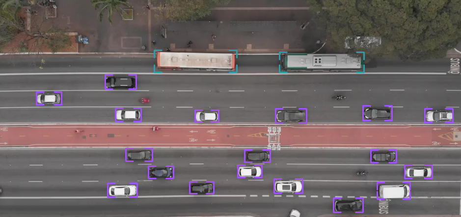

# Aerial Object Detection
This repository contains a Python-based aerial object detection pipeline. It supports both image and video inputs, and leverages a custom model pipeline to detect objects in aerial imagery. The project uses OpenCV for image/video processing and `supervision` for annotation and visualization.    



## Installation
### Prerequisites
- Python 3.8 or higher
- CUDA (optional, for GPU support)


### Steps
1. Clone the repository:
```bash
  git clone https://github.com/your-username/aerial-object-detection.git
  cd aerial-object-detection
```

2. Install the required dependencies:
```bash
  pip install -r requirements.txt
```

3. (Optional) If you want to use GPU acceleration, ensure you have the correct version of PyTorch installed with CUDA support. You can install it using:
```bash
  pip install torch torchvision --index-url https://download.pytorch.org/whl/cu118
```


## Usage
### Running the Script
To process an image or video, use the following commands:
```bash
  # Process an image
  python demo.py --image-input data/image_dense_example.png 
  
  # Process an video
  python demo.py --video-input data/video_dense_example.mp4 --tracker bytetrack
```

### Command-Line Arguments
The script supports the following command-line arguments:
| Argument | Description | Default Value |  
| ----------------------- | ----------------------------------------------- | --------- |
| --image-input           | Path to the input image file.                   | None      |
| --video-input	          | Path to the input video file.	                  | None      |
| --detector              |	Name of the detector model to use.              | waldo30   |
| --confidence-threshold  | Confidence threshold for object detection.      | 0.8       |
| --overlap-height-ratio  |	Overlap height ratio for processing.            | 0.2       |
| --overlap-width-ratio   |	Overlap width ratio for processing.	            | 0.2       |
| --tracker               |	Name of the tracker to use (None or bytetrack). | None      |
| --device	              | Device to run the model on (cpu or cuda).       | cpu       |


## License
This project is licensed under the MIT License. See the LICENSE file for details.