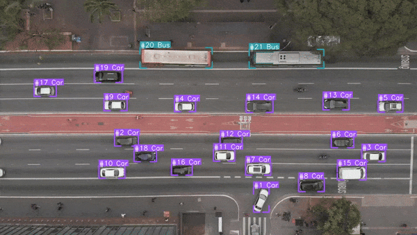

# PiSAR: Pipeline for Aerial Search and Rescue  
✈️ *AI-powered visual detection pipeline for aerial search operations*  

PiSAR is an open-source pipeline designed to streamline aerial search and rescue missions using advanced AI-based visual detection. It enables rapid analysis of aerial imagery and video to assist responders in locating people or objects of interest.

**Try PiSAR online:**  
You can test PiSAR directly in your browser via our [PiSAR Space](https://huggingface.co/spaces/eadali/PiSAR).

    


## Installation

### Prerequisites
- Python 3.8+
- pip3 (Python package installer)
- *(Optional)* CUDA-enabled GPU & CUDA Toolkit for GPU acceleration

### Setup

1. **Clone the repository**
    ```bash
    git clone https://github.com/eadali/PiSAR.git
    cd PiSAR
    ```

2. **(Recommended) Create a virtual environment**
    ```bash
    python3 -m venv pisar
    source pisar/bin/activate
    ```

3. **Install dependencies**
    - **CPU only:**
        ```bash
        pip3 install -r requirements.txt
        ```
    - **GPU (CUDA) support:**
        ```bash
        pip3 install -r requirements-cuda.txt
        ```

4. **(Optional) Install PyTorch with a specific CUDA version**  
   See [PyTorch's official instructions](https://pytorch.org/get-started/locally/).

5. **Verify installation**
    ```bash
    python3 -c "import torch; print(torch.cuda.is_available())"
    ```

*See `requirements.txt` and `requirements-cuda.txt` for details.*

---

## Usage
### Running the Script
To process an image or video, use the following commands:
```bash
  # Process an image
  python3 demo.py --image-input data/image_dense_example.png 
  
  # Process an video
  python3 demo.py --video-input data/video_dense_example.mp4 --tracker bytetrack
```

### Command-Line Arguments
The script supports the following command-line arguments:
| Argument | Description | Default Value |  
| ----------------------- | ----------------------------------------------- | --------- |
| --image-input           | Path to the input image file.                   | None      |
| --video-input	          | Path to the input video file.	                  | None      |
| --detector              |	Name of the detector model to use.              | waldo30   |
| --confidence-threshold  | Confidence threshold for object detection.      | 0.8       |
| --overlap-height-ratio  |	Overlap height ratio for processing.            | 0.2       |
| --overlap-width-ratio   |	Overlap width ratio for processing.	            | 0.2       |
| --tracker               |	Name of the tracker to use (None or bytetrack). | None      |
| --device	              | Device to run the model on (cpu or cuda).       | cpu       |


---

## License

This project is licensed under the MIT License. See the [LICENSE](LICENSE) file for details.
