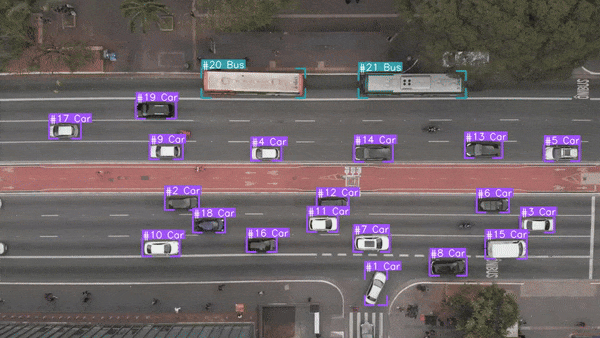

# PeSAR: Perception for Search and Rescue  
🛸 *AI-powered visual detection system for aerial search operations*  

  

PeSAR is a computer vision system designed to detect objects and persons of interest in aerial footage. Optimized for search and rescue missions, it processes visual data with high precision in challenging environments.  

**Core Capabilities:**  
- 🎯 High-accuracy object detection  
- 🚀 Real-time processing  
- 📷 Supports images and video streams  
- 📊 Intelligent annotation and visualization  

## 🖥️ Setup & Configuration

### System Requirements
- **OS**: Linux (Ubuntu 20.04+)
- **Python**: 3.8+
- **Hardware**: 
  - Minimum: 4GB RAM, Intel i5
  - Recommended: NVIDIA GPU (RTX 2060+), 16GB RAM

### Setup  
#### Install PyTorch:
```bash
  pip3 install torch torchvision
```

```bash
  git clone https://github.com/your-username/PeSAR.git
  cd PeSAR
```

```bash
  python -m venv --system-site-packages pesar-env
  source pesar-env/bin/activate c
```

## Usage
### Running the Script
To process an image or video, use the following commands:
```bash
  # Process an image
  python demo.py --image-input data/image_dense_example.png 
  
  # Process an video
  python demo.py --video-input data/video_dense_example.mp4 --tracker bytetrack
```

### Command-Line Arguments
The script supports the following command-line arguments:
| Argument | Description | Default Value |  
| ----------------------- | ----------------------------------------------- | --------- |
| --image-input           | Path to the input image file.                   | None      |
| --video-input	          | Path to the input video file.	                  | None      |
| --detector              |	Name of the detector model to use.              | waldo30   |
| --confidence-threshold  | Confidence threshold for object detection.      | 0.8       |
| --overlap-height-ratio  |	Overlap height ratio for processing.            | 0.2       |
| --overlap-width-ratio   |	Overlap width ratio for processing.	            | 0.2       |
| --tracker               |	Name of the tracker to use (None or bytetrack). | None      |
| --device	              | Device to run the model on (cpu or cuda).       | cpu       |


## License
This project is licensed under the MIT License. See the LICENSE file for details.